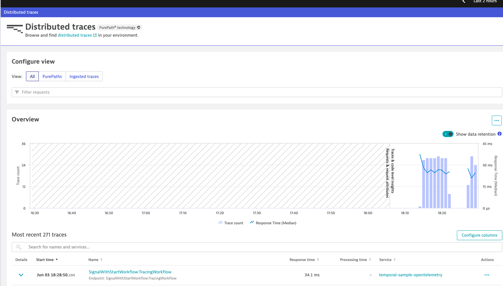

# Run example


## Collector

- modify config.yaml to connect to your dynatrace instance


- run otelcollector 
```
docker run --rm \
--name dt-otelcol \
-p 4317:4317  \
-v $(pwd)/config.yaml:/collector.yaml \
-v $(pwd)/config.yaml:/etc/otelcol-contrib/config.yaml otel/opentelemetry-collector-contrib:0.101.0
```


- Run Starter.java and TracingWorker.java. 

Since the collector is logging the traces, you should see the traces (where you run the collector) 
before they are sent to Dynatrace.





