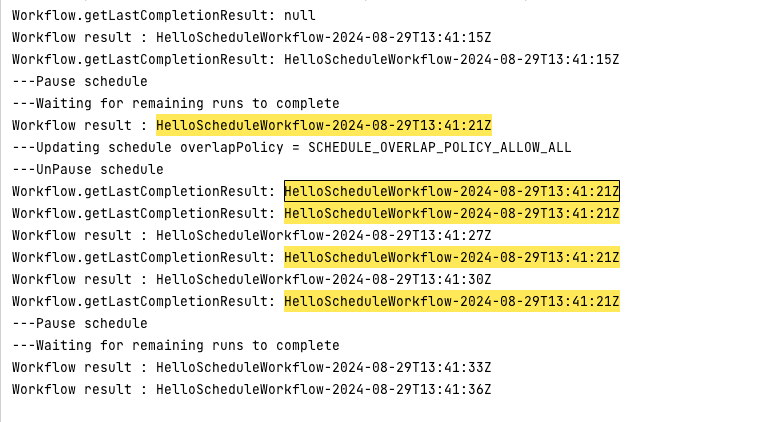

---io.temporal.client.schedules.ScheduleException: Schedule exception
Workflow.getLastCompletionResult: null
Workflow result : HelloScheduleWorkflow-2024-08-29T13:41:15Z
Workflow.getLastCompletionResult: HelloScheduleWorkflow-2024-08-29T13:41:15Z
---Pause schedule
---Waiting for remaining runs to complete
Workflow result : HelloScheduleWorkflow-2024-08-29T13:41:21Z
---Updating schedule overlapPolicy = SCHEDULE_OVERLAP_POLICY_ALLOW_ALL
---UnPause schedule
Workflow.getLastCompletionResult: HelloScheduleWorkflow-2024-08-29T13:41:21Z
Workflow.getLastCompletionResult: HelloScheduleWorkflow-2024-08-29T13:41:21Z
Workflow result : HelloScheduleWorkflow-2024-08-29T13:41:27Z
Workflow.getLastCompletionResult: HelloScheduleWorkflow-2024-08-29T13:41:21Z
Workflow result : HelloScheduleWorkflow-2024-08-29T13:41:30Z
Workflow.getLastCompletionResult: HelloScheduleWorkflow-2024-08-29T13:41:21Z
---Pause schedule
---Waiting for remaining runs to complete
Workflow result : HelloScheduleWorkflow-2024-08-29T13:41:33Z
Workflow result : HelloScheduleWorkflow-2024-08-29T13:41:36Z

