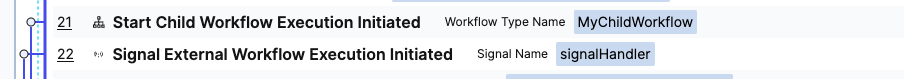

## Start temporal server


## Reproduce replay NDE with Kotlin

Note the workflow implementation in [Workflow_Kotlin_Runner.kt](src/main/kotlin/com/test/Workflow_Kotlin_Runner.kt)

```
if(WorkflowInternal.isReplaying()){
    //      4	use getVersion
    Workflow.getVersion("get-child-workflow", 
            Workflow.DEFAULT_VERSION, 1);
}

```

### With Temporal SDK 1.20

- Set the temporal version to 1.20 in the [pom.xml](pom.xml) file 

- Run [Workflow_Kotlin_Runner.kt](src/main/kotlin/com/test/Workflow_Kotlin_Runner.kt)

- The runner will throw a NDE after querying the workflow (witch will trigger workflow replay)
```
Caused by: io.grpc.StatusRuntimeException: INVALID_ARGUMENT: io.temporal.worker.NonDeterministicException: Failure handling event 21 of type 'EVENT_TYPE_SIGNAL_EXTERNAL_WORKFLOW_EXECUTION_INITIATED' during replay. Event 21 of type EVENT_TYPE_SIGNAL_EXTERNAL_WORKFLOW_EXECUTION_INITIATED does not match command type COMMAND_TYPE_START_CHILD_WORKFLOW_EXECUTION. {WorkflowTaskStartedEventId=0, CurrentStartedEventId=19}
	at io.temporal.internal.statemachines.WorkflowStateMachines.handleCommandEvent(WorkflowStateMachines.java:442)
	at io.temporal.internal.statemachines.WorkflowStateMachines.handleSingleEvent(WorkflowStateMachines.java:346)
	at io.temporal.internal.statemachines.WorkflowStateMachines.handleEventsBatch(WorkflowStateMachines.java:273)

```


### With Temporal SDK 1.26.1

- Set the temporal version to 1.26.1 in the [pom.xml](pom.xml) file

- Run [Workflow_Kotlin_Runner.kt](src/main/kotlin/com/test/Workflow_Kotlin_Runner.kt)

- It just works, even if some events in the workflow history are swapped


## Running with Java

If we run the same workflow in Java, [Workflow_Java_Runner.java](src/main/kotlin/com/test/Workflow_Java_Runner.java) 
the workflow history is different.



---


