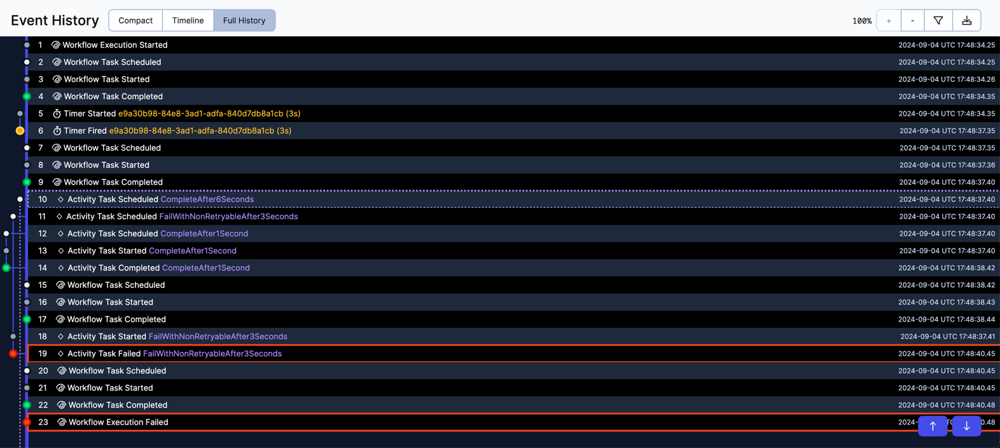
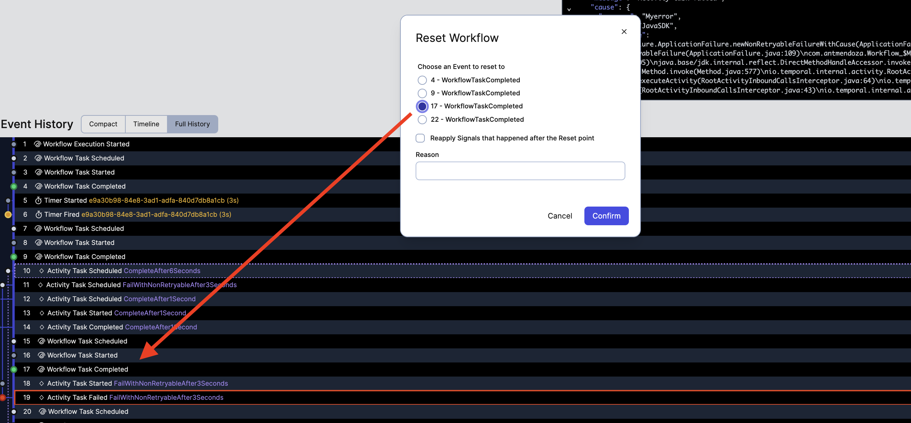

# Reset parallel branches


### Run the code

- Run the starter
```bash
./mvnw compile exec:java -Dexec.mainClass="com.antmendoza.MyStarter" 
```


- Run the worker
```bash
./mvnw compile exec:java -Dexec.mainClass="com.antmendoza.MyWorker" -DfailBranch2=true
```

#### Expected behaviour
The workflow will be marked as failed after `failWithNonRetryableAfter3Seconds` throws a non-retryable error 




### "Fix" the activity and reset the workflow 
- Stop the worker
- Start it again without the parameter `failBranch2`, so the activity `failWithNonRetryableAfter3Seconds` won't fail for this execution.
```bash
./mvnw compile exec:java -Dexec.mainClass="com.antmendoza.MyWorker"
```


- Reset the workflow right before the `failWithNonRetryableAfter3Seconds` failed event.



#### Expected behaviour
The workflow schedule `failWithNonRetryableAfter3Seconds` and `completeAfter6Seconds`, waits for the activities to complete and completes successfully 

Note that activity `completeAfter1Second` is not scheduled since the event ActivityTaskCompleted for this activity is recorded in the new (after reset) event history. 


