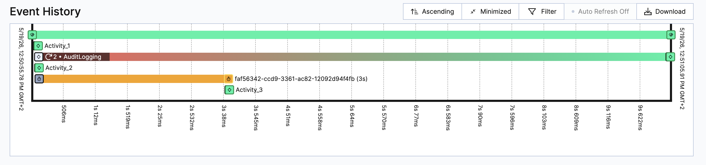

# Audit Logging POC

Every main/marked for tracking activity should be followed by an `auditLogging` step. 
This should be implemented as a separate activity, but for cost efficiency reasons it is implemented as part of the same activity executions (resulting each activity in two operations: one for the activity itself, one for the audit logging)

The audit is attempted *inline on the activity worker first*, and only if that inline attempt fails (and the caller asked for tracking) does the workflow schedule a real `auditLogging` Temporal activity as a fallback.

## Components

### `SimpleActivityInterceptor` (activity-side)

Wraps `ActivityInboundCallsInterceptor.execute(...)`. After each activity attempt:

- If the activity returned a `MyActivityResult`, invokes `new GreetingActivitiesImpl().auditLogging()` as a **direct POJO call** (bypasses the activity stub — no scheduled Temporal activity, no history event, no retries; runs in the worker thread of the activity currently being intercepted).
- If that inline call succeeds, returns a `MyActivityResult` with `auditLoggingActivitySuccess = true`.
- If it errors, catches the exception and returns a `MyActivityResult` with `auditLoggingActivitySuccess = false`.

The `auditLoggingActivitySuccess` flag is what the workflow side reads to decide whether to schedule the fallback.

### `SimpleWorkflowInterceptor` (workflow-side)

- **`WorkflowOutboundCallsInterceptor.executeActivity`**: blocks on the activity result and, if `isAuditLoggingActivitySuccess() == false`, schedules a fallback `auditLogging` activity via `Async.procedure(...)` and adds its `Promise<Void>` to `auditLoggingPromises`.
- **`WorkflowInboundCallsInterceptor.execute`**: runs the workflow, then awaits `Promise.allOf(outbound.auditLoggingPromises)` so the workflow only completes once every fallback audit activity has finished.


Both interceptors are registered via `WorkerFactoryOptions.setWorkerInterceptors(...)` in `Starter`.

## Run

Start a local Temporal server on `:7233`, then:

```bash
./mvnw compile exec:java -Dexec.mainClass="io.temporal.samples.Starter"
```


## Output

The workflow runs 
- `activity_1` (`trackAuditLogging=true`) 
- `activity_2` (`trackAuditLogging=false`)
- `Workflow.sleep(Duration.ofSeconds(3))` to simulate time to allow audit logging downstream service to recover
- `activity_3` (`trackAuditLogging=true`) 

`GreetingActivitiesImpl.auditLogging()` throws for the first two invocations and 
succeeds afterwards (shared static counter). With `activity_2` opting out via
`trackAuditLogging=false`, the inline audit attempt only runs for `activity_1`
and `activity_3`. The inline attempt for `activity_1` fails (first call → throw),
so the workflow schedules a fallback `auditLogging` activity for it. By the time
`activity_3` runs (after `Workflow.sleep(3s)` and the fallback retries), the
shared counter is past the throwing window, so its inline audit succeeds, and no
fallback is scheduled.  

The fallback `auditLogging` stub is configured with `initialInterval=10s` and `backoffCoefficient=1.0` so retries are slow enough to make the post-workflow wait at `Promise.allOf(...).get()` visible in the run output.


