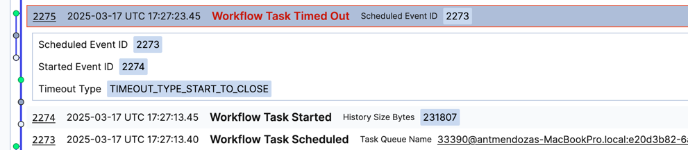

# Demo

This project shows how large workflow histories can impact the performance of workflow query latencies.

The worker has a limited workflow cache size of 5 workflow executions to force workflow force eviction +
workflow replay whenever the worker received a workflow task or query task for an execution that is not in the cache.

There are two type of workflows:
- [MyWorkflowRunForeverImpl.java](src/main/java/com/temporal/workflow/MyWorkflowRunForeverImpl.java): executes a single activity in a loop forever
- [MyWorkflowCANImpl.java](src/main/java/com/temporal/workflow/MyWorkflowCANImpl.java): executes a single activity and CAN if the event history length > 100

Additionally, there is a data converter [MyDataConverter.java](src/main/java/com/temporal/workflow/MyDataConverter.java) 
that add a small latency converting payloads to simulate a real-world scenario.

The activity [MyActivityImpl.java](src/main/java/com/temporal/workflow/MyActivityImpl.java) sleeps for 100 ms.

The starter starts 10 workflows (5 of each type) and then query the workflows in a loop and prints
the query latency if the latency exceeds a threshold (500ms).


### Expected Result

- As the event history for MyWorkflowRunForeverImpl workflows grows, the query latency increases.

```

Mon Mar 17 18:11:08 CET 2025 :: MyWorkflowRunForever0
-------------
Printing if query takes > 500 ms; querying every 500 ms
> Query took [ 4306 ms]
> HistoryLength [ 2121 events]

Mon Mar 17 18:11:10 CET 2025 :: MyWorkflowRunForever1
-------------
Printing if query takes > 500 ms; querying every 500 ms
> Query took [ 3939 ms]
> HistoryLength [ 2063 events]

Mon Mar 17 18:11:11 CET 2025 :: MyWorkflowRunForever4
-------------
Printing if query takes > 500 ms; querying every 500 ms
> Query took [ 3982 ms]
> HistoryLength [ 2063 events]
```

- Eventually instances of MyWorkflowRunForeverImpl will start failing with WorkflowTaskTimeout due to the large workflow history.




### Start the worker and the starter
```bash
./mvnw compile exec:java -Dexec.mainClass="com.temporal.MyWorker"

```
```bash
./mvnw compile exec:java -Dexec.mainClass="com.temporal.Starter"

```

