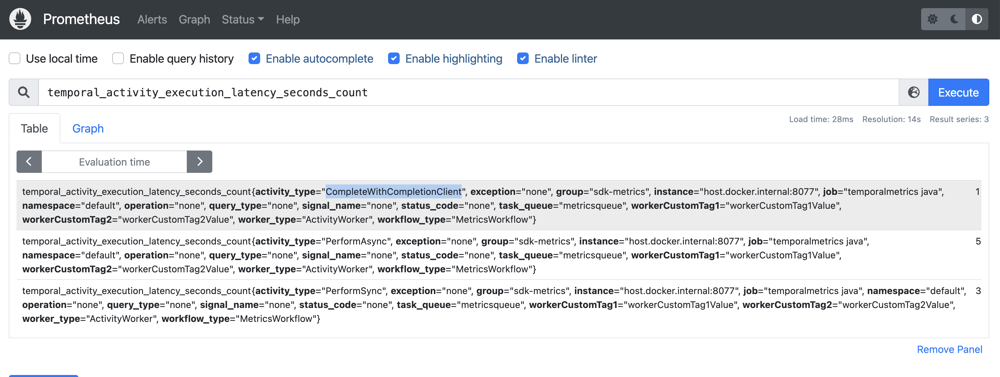
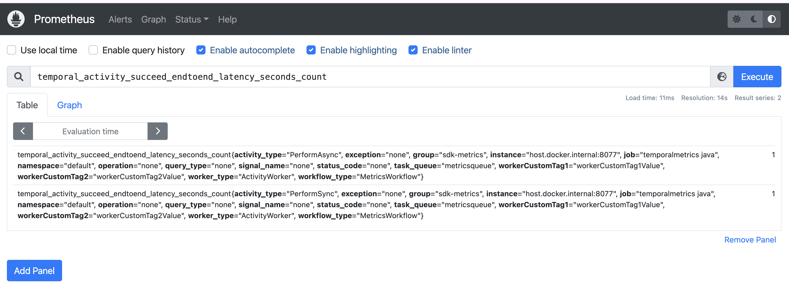

# Setting up SDK metrics (Prometheus)

This sample shows setup for SDK metrics.

1. Start prometheus:
```bash
docker compose up
```

2. Start the Worker:
```bash
MetricsWorker.java
```

3. Start the Starter:
```bash
MetricsStarter.java
```


- activity_succeed_endtoend_latency not reported when completing the activity with ActivityCompletionClient

http://localhost:9090/graph?g0.expr=temporal_activity_succeed_endtoend_latency_seconds_count&g0.tab=1&g0.stacked=0&g0.show_exemplars=0&g0.range_input=1h




- activity_execution_latency is reported as expected 
http://localhost:9090/graph?g0.expr=temporal_activity_execution_latency_seconds_count&g0.tab=1&g0.stacked=0&g0.show_exemplars=0&g0.range_input=1h




