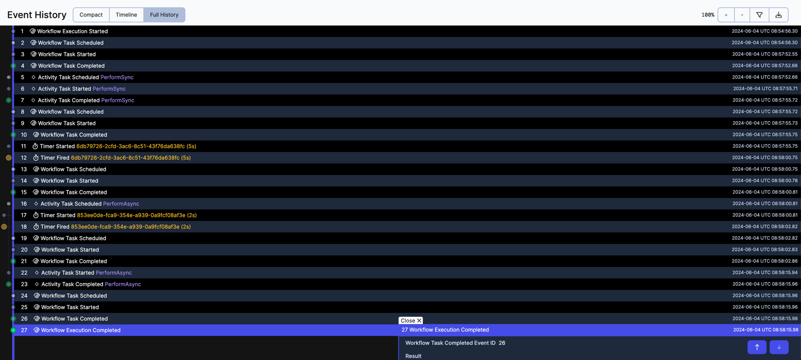
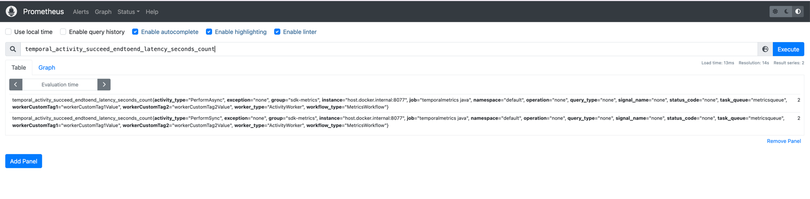

# Setting up SDK metrics (Prometheus)

This sample shows setup for SDK metrics.

1. Start the Worker:
```bash
MetricsWorker.java
```

2. Start the Starter:
```bash
MetricsStarter.java
```

3. See the worker metrics on the exposed Prometheus Scrape Endpoint: [http://localhost:8077/metrics](http://localhost:8077/metrics)





