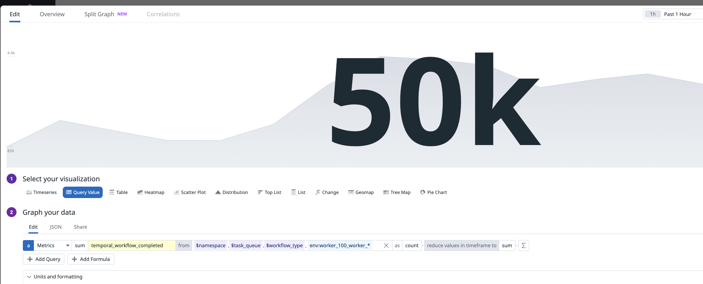

# OpenTelemetry Sample


``` bash
poetry install --with open_telemetry
```

Before starting the collector, edit the [collector.yaml](collector%2Fcollector.yaml) file to add the dd api_key


```bash
docker compose down --remove-orphans && docker volume prune -f

docker-compose up 

```

### Otel / Datadog


Start ten workers

``` bash
ps aux | grep worker.py

pkill -f worker.py

for i in {1..10}; do export WORKER_ID=100_WORKER___$i; poetry run python3 worker.py & done
```

Start 50K workflows

``` bash
export WORKER_ID=CLIENT
export WORKFLOW_COUNT=50000
poetry run python3 starter_new_code.py
```





---


### Prometheus


Start three workers

``` bash
export PROMETHEUS_PORT=9001
poetry run python3 worker.py  
```

``` bash
export PROMETHEUS_PORT=9002
poetry run python3 worker.py  
```

``` bash
export PROMETHEUS_PORT=9003
poetry run python3 worker.py   
```

Start 10252 workflows

``` bash
export WORKFLOW_COUNT=10252
export PROMETHEUS_PORT=9000
poetry run python3 starter_new_code.py
```

#### Navigate to prometheus and query temporal_workflow_completed

http://localhost:9090/graph?g0.expr=sum(temporal_workflow_completed)&g0.tab=0&g0.stacked=0&g0.show_exemplars=0&g0.range_input=15m


## references
https://docs.datadoghq.com/opentelemetry/guide/otlp_delta_temporality/


