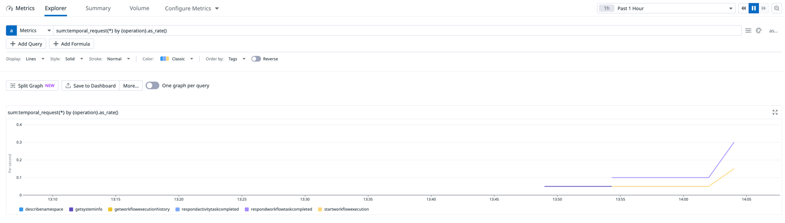

# OpenTelemetry Sample


``` bash
poetry install --with open_telemetry
```

Before starting the collector, edit the [collector.yaml](collector%2Fcollector.yaml) file to add the dd api_key


```bash

cd collector

docker compose down --remove-orphans && docker volume prune -f

docker-compose up 

```


Start the worker

``` bash
poetry run python3 worker.py
```

Start the starter

``` bash
poetry run python3 starter.py
```


Go to https://app.datadoghq.com/metric/explorer and add the following query 
```
sum:temporal_request{*} by {operation}.as_rate()
```



