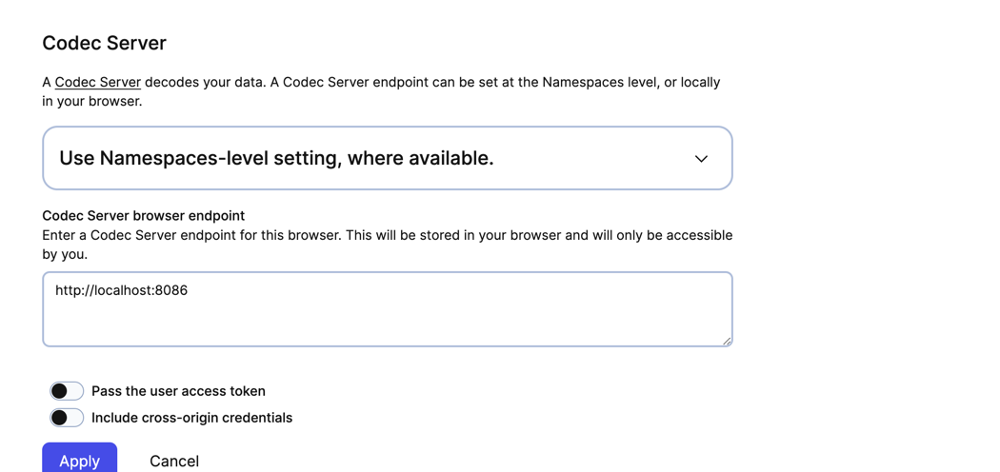

# Encryption Sample (TC) 


```bash
    poetry install
```


```bash
 poetry run python3 starter.py --target-host antonio.a2dd6.tmprl.cloud:7233 --namespace antonio.a2dd6 \
        --client-cert ~/dev/temporal/certificates/namespace-antonio-perez/client.pem  \
        --client-key ~/dev/temporal/certificates/namespace-antonio-perez/client.key

```

``` bash
 poetry run python3 worker.py --target-host antonio.a2dd6.tmprl.cloud:7233 --namespace antonio.a2dd6 \
        --client-cert ~/dev/temporal/certificates/namespace-antonio-perez/client.pem  \
        --client-key ~/dev/temporal/certificates/namespace-antonio-perez/client.key

```


- Start a codec server in another terminal:

```bash
    poetry run python codec_server.py
```


- Add the codec server url to the temporal UI 
