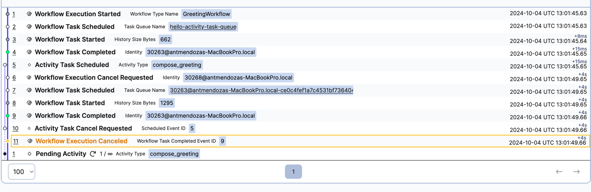
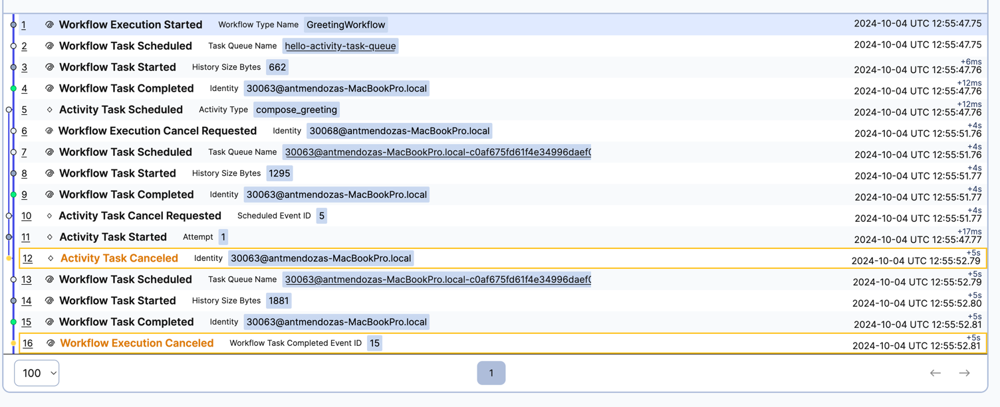
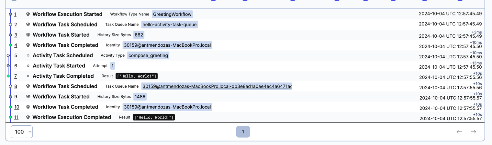

```bash
    poetry install
```


``` bash
poetry run python3 worker.py 

```

```bash
poetry run python3 starter.py 

```


## Send cancellation request after 4 seconds with default activity options 

- in worker.py
```
    return await workflow.execute_activity(
        ...
        ...
        # Tell the workflow to wait for the post-cancel result
        # cancellation_type=workflow.ActivityCancellationType.WAIT_CANCELLATION_COMPLETED,
    )

```


**logs / output**

```
heartbeting ...
activity running ...0
activity running ...1
heartbeting ...
activity running ...2
heartbeting ...
activity running ...3
heartbeting ...
activity running ...4
heartbeting ...


```





## Send cancellation request after 4 seconds having activity options with cancellation_type=workflow.ActivityCancellationType.WAIT_CANCELLATION_COMPLETED

- in worker.py

```
  return await workflow.execute_activity(
      ......
      # Tell the workflow to wait for the post-cancel result
      cancellation_type=workflow.ActivityCancellationType.WAIT_CANCELLATION_COMPLETED,

  )
  
 
```
**logs / output**

```

heartbeting ...
activity running ...0
heartbeting ...
activity running ...1
heartbeting ...
activity running ...2
heartbeting ...
activity running ...3
heartbeting ...
activity running ...4
heartbeting ...

```




## Run everything without sending a cancellation request 


- in worker.py

```
# await client.get_workflow_handle(workflow_id).cancel();

```
**logs / output**

```

heartbeting ...
activity running ...0
heartbeting ...
activity running ...1
heartbeting ...
activity running ...2
heartbeting ...
activity running ...3
activity running ...4
heartbeting ...
activity running ...5
heartbeting ...
activity running ...6
heartbeting ...
activity running ...7
heartbeting ...
activity running ...8
heartbeting ...
heartbeting ...
activity running ...9
heartbeting ...

```




