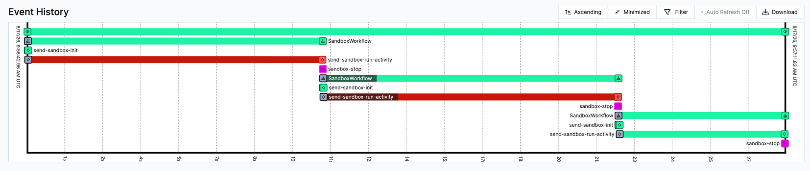

# Sandbox worker self-healing

> **PoC only.** This is a proof of concept that uses a mock to simulate AWS Bedrock

Temporal workers on AWS Bedrock **AgentCore Runtime**, where the worker
runs *inside* an ephemeral micro-VM.

The main goal is to demonstrate the use of Temporal to **detect when the micro-VM goes
down and bring the work back up on a new one.**

## Layout

- `core/` — workflows + activities + SDK:
  - `parent_workflow.py` — `ParentRecreateWorkflow` plus the in-workflow `Sandbox` handle
    and `new_sandbox`: creates a sandbox, runs work, and on a lost micro-VM **creates a
    new sandbox** and retries. Work resumes from a durable checkpoint, so it finishes even
    though no single VM lives long enough.
  - `sandbox_workflow.py` — `SandboxWorkflow`, the child (workflow ID == sandbox ID):
    `init` provisions the VM (booting the in-VM worker), `execute_activity` runs the work
    on `sandbox-<id>`, `stop` tears it down. A lost VM surfaces as an activity timeout
    tagged `SANDBOX_WORKER_LOST`, which propagates to the parent.
  - `activities.py`, `dispatch.py`, `compute.py`, `registration.py`,
    `providers/` — the SDK + the `mock-agentcore` provider, which boots a real in-VM
    worker subprocess and evicts it after `max_lifetime` (no AWS/boto3; runs locally).
- `workers/` — `orchestrator_worker.py` (always-on: runs both workflows + provisioning)
  and `vm_worker.py` (the ephemeral in-VM worker, one per sandbox).
- `starter/main.py` — starts `ParentRecreateWorkflow`.

## Install dependencies

```bash
uv sync
```

## Run it

Three terminals:

```bash
temporal server start-dev
```


```bash
.venv/bin/python -u -m workers.orchestrator_worker
```


```bash
.venv/bin/python -m starter.main
```

Expected result — in the **starter** terminal:

```
result: completed 20s of work on task queue sandbox-<id> (last resumed from 14s) [completed with 3 sandbox(es)]
```

`completed with N sandbox(es)` shows the work survived the micro-VM evictions.
`last resumed from …s` is where the **final** sandbox picked up — the tail of a chain of
resumes across all N sandboxes (e.g. 0→7s, 7→14s, 14→20s), not a single resume. Watch the
`progress …/20s` lines in the orchestrator terminal to see the full chain, one segment per
sandbox.

In the **orchestrator worker** terminal you'll see the `booted … / evicted …` cycle — a
new `sandbox-<id>` per recreated VM — interleaved with a `sandbox N lost (…); tearing it
down and recreating` line for each loss. Each eviction also logs a `temporalio.exceptions…`
traceback and `Completing activity as failed`; that is expected (the SDK recording the
timed-out attempt), not a crash — the parent catches it and recreates the sandbox.




## Knobs

In `core/parent_workflow.py`: `WORK_SECONDS` (default 20), `VM_MAX_LIFETIME_SECONDS`
(default 8), `MAX_SANDBOXES` (default 6). Set `WORK_SECONDS` above `VM_MAX_LIFETIME_SECONDS`
to force recreations.
