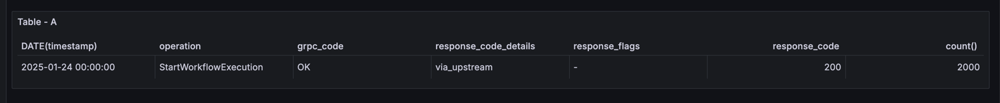
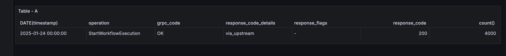

# Hello World with mTLS

We're using @grpc/grpc-js@1.12.0 and 1.11.2 for the Temporal SDK.
```
❯ npm ls --all | grep  grpc-js
├─┬ @grpc/grpc-js@1.12.0
│ ├── @grpc/grpc-js@1.12.0 deduped
```

- start 2000 workflows without interceptors 




```

  const connection = await Connection.connect({
    address,
    tls: {
      serverNameOverride,
      serverRootCACertificate,
      clientCertPair: {
        crt: await fs.readFile(clientCertPath),
        key: await fs.readFile(clientKeyPath),
      },
    },
  });
  const client = new Client({ connection, namespace });


```


- start 2000 workflows with interceptors
  + `+ 2000` 





```

  const connection = await Connection.connect({
    address,
    tls: {
      serverNameOverride,
      serverRootCACertificate,
      clientCertPair: {
        crt: await fs.readFile(clientCertPath),
        key: await fs.readFile(clientKeyPath),
      },
    },
    
    ------------
    
    channelArgs: {
      'grpc.default_authority': address,
      'grpc.keepalive_permit_without_calls': 1,
      'grpc.keepalive_time_ms': 15_000,
      'grpc.keepalive_timeout_ms': 15_000,
    },
    interceptors: [
      (opts, nextCall) => {
        opts.deadline = Date.now() + 15_000;
        return new InterceptingCall(nextCall(opts));
      },
      makeGrpcRetryInterceptor(defaultGrpcRetryOptions()),
    ],
    
    ^^^^^------------
    
    
  });
  const client = new Client({ connection, namespace });

```


```bash

npm run workflow

```

