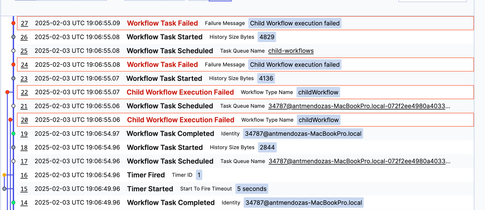

### Running this sample

1. `temporal server start-dev` to start [Temporal Server](https://github.com/temporalio/cli/#installation).
2. `npm install` to install dependencies.
3. `npm run start.watch` to start the Worker.
4. In another shell, `npm run workflow` to run the Workflow.

### Output
The parent workflow should fail if one of the child workflows fail and the error is not handled. 

Sometimes, unhandled ChildWorkflowFailure cause workflowTaskFailure instead of failing the workflow.




The folder [./wh](./wh) contains the workflow histories with a reproduction of this issue.

This behaviour only happen if the two child workflows fail at the same time. I guess when the two ChildWorkflowFailure are 
delivered as part of the same workflow task.

Waiting for the child workflows to complete/fail with 

```
await Promise.all(childs);` 
```


instead of 
```
    for (const pendingResult of childs) {
      console.log(await pendingResult);
    }
```


works as expected (the error is propagated to the parent workflow).