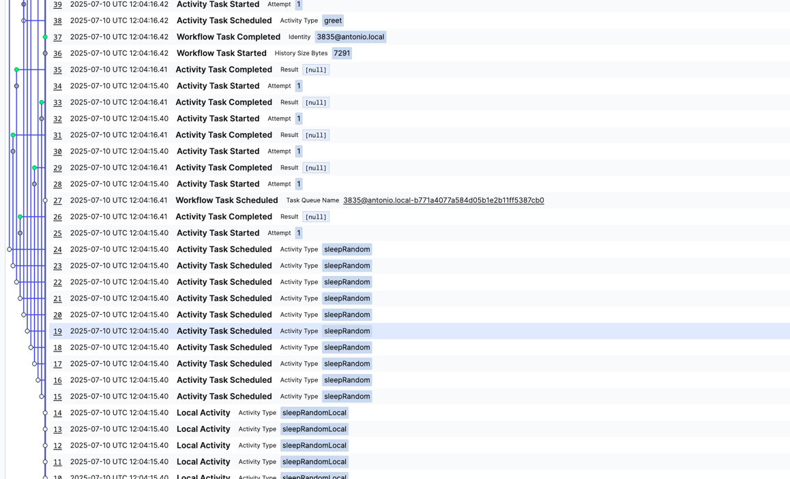

### Terminal 1: Start the Temporal server

```bash
pnpm dev:temporal
```

### Terminal 2: Start the worker

```bash
pnpm dev:worker
```

### Terminal 3: Run the client

```bash
pnpm dev:client
```

We fail the workflow task intentionally to force replay, and during replay the workflow task fails with NDE


Activities are scheduled in the following order according the information captured in the [workflow interceptor](/packages/worker/src/interceptors/workflow-interceptor.ts): 

> Search for `globalThis.activities.push(input.activityType+"-"+input.seq)`

`sleepRandomLocal-1, sleepRandomLocal-2, sleepRandomLocal-3, sleepRandomLocal-4, sleepRandomLocal-5, sleepRandomLocal-6, sleepRandomLocal-7, sleepRandomLocal-8, sleepRandomLocal-9, sleepRandomLocal-10, sleepRandom-11, sleepRandom-12, sleepRandom-13, sleepRandom-14, sleepRandom-15, sleepRandom-16, sleepRandom-17, sleepRandom-18, sleepRandom-19, sleepRandom-20, greet-21, greet-22`

and during replay the order is similar

`sleepRandomLocal-1, sleepRandomLocal-2, sleepRandomLocal-3, sleepRandomLocal-4, sleepRandomLocal-5, sleepRandomLocal-6, sleepRandomLocal-7, sleepRandomLocal-8, sleepRandomLocal-9, sleepRandomLocal-10, sleepRandom-11, sleepRandom-12, sleepRandom-13, sleepRandom-14, sleepRandom-15, sleepRandom-16, sleepRandom-17, sleepRandom-18, sleepRandom-19`

Then the SDK fails the workflow task with NDE, event 38

```
2025-07-10T12:04:18.434072Z  WARN temporal_sdk_core::worker::workflow: Failing workflow task run_id=0197f438-d72b-7013-8318-f07bddaa695c failure=Failure { failure: Some(Failure { message: "[TMPRL1100] Nondeterminism error: No command scheduled for event 
HistoryEvent(id: 38, ActivityTaskScheduled)", source: "", stack_trace: "", encoded_attributes: None, cause: None, failure_info: Some(ApplicationFailureInfo(ApplicationFailureInfo { r#type: "", non_retryable: false, details: None, next_retry_delay: None, category: Unspecified })) }), force_cause: NonDeterministicError }
```




