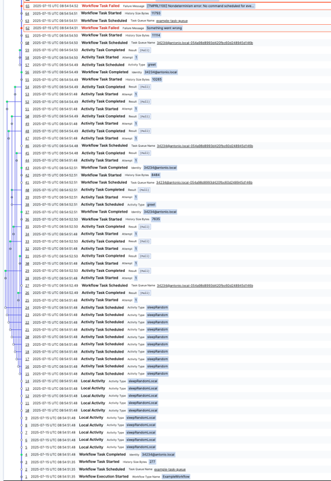

### Terminal 1: Start the Temporal server

```bash
pnpm dev:temporal
```

### Terminal 2: Start the worker

```bash
pnpm dev:worker
```

### Terminal 3: Run the client

```bash
pnpm dev:client
```

We fail the workflow task intentionally to force replay, and during replay the workflow task fails with NDE


Activities are scheduled in the following order according the information captured in the [workflow interceptor](/packages/worker/src/interceptors/workflow-interceptor.ts): 

> Search for `globalThis.activities.push(input.activityType+"-"+input.seq)`

`sleepRandomLocal-1 a, sleepRandomLocal-1 b, sleepRandomLocal-1 c, sleepRandomLocal-1 d, sleepRandomLocal-1 e, sleepRandomLocal-3 a, sleepRandomLocal-3 b, sleepRandomLocal-3 c, sleepRandomLocal-3 d, sleepRandomLocal-3 e, sleepRandom-1 c, sleepRandom-1 a, sleepRandom-3 e, sleepRandom-3 d, sleepRandom-1 b, sleepRandom-3 a, sleepRandom-1 e, sleepRandom-3 c, sleepRandom-3 b, sleepRandom-1 d, greet-undefined, greet-undefined`

and during replay the order is similar

`sleepRandomLocal-1 a, sleepRandomLocal-1 b, sleepRandomLocal-1 c, sleepRandomLocal-1 d, sleepRandomLocal-1 e, sleepRandomLocal-3 a, sleepRandomLocal-3 b, sleepRandomLocal-3 c, sleepRandomLocal-3 d, sleepRandomLocal-3 e, sleepRandom-1 a, sleepRandom-1 b, sleepRandom-1 c, sleepRandom-1 d, sleepRandom-1 e, sleepRandom-3 a, sleepRandom-3 b, sleepRandom-3 c, sleepRandom-3 d`

Then the SDK fails the workflow task with NDE, event 38

```
2025-07-15T08:54:54.526968Z  WARN temporal_sdk_core::worker::workflow: Failing workflow task run_id=01980d4b-3cd8-7271-abfb-0c98f28d3e91 failure=Failure { failure: Some(Failure { message: "[TMPRL1100] Nondeterminism error: No command scheduled for event HistoryEvent(id: 38, ActivityTaskScheduled)", source: "", stack_trace: "", encoded_attributes: None, cause: None, failure_info: 
Some(ApplicationFailureInfo(ApplicationFailureInfo { r#type: "", non_retryable: false, details: None, next_retry_delay: None, category: Unspecified })) }), force_cause: NonDeterministicError }
```




