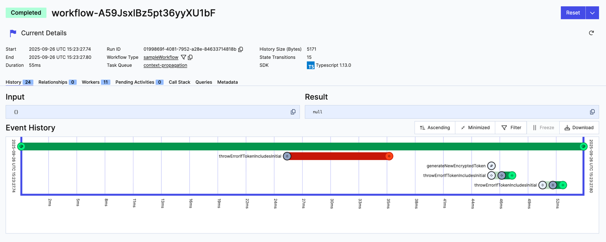

# Retry activity wityh new token if AuthError occurs

### Running this sample

1. `temporal server start-dev` to start [Temporal Server](https://github.com/temporalio/cli/#installation).
1. `npm install` to install dependencies.
1. `npm run start.watch` to start the Worker.
1. In another shell, `npm run workflow` to run the Workflow.

