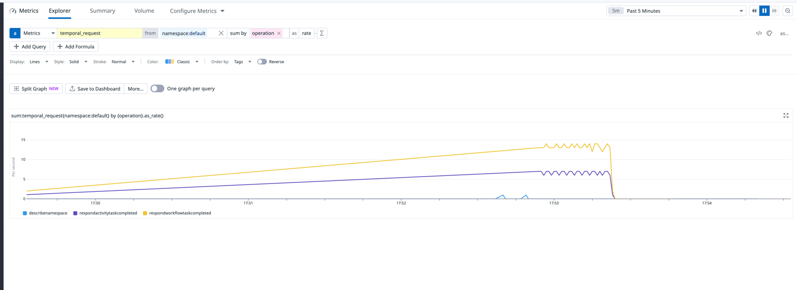

# Traces to DD


Before starting the collector, edit the [collector.yaml](collector%2Fcollector.yaml) file to add the dd api_key


```bash

cd collector

docker compose down --remove-orphans && docker volume prune -f

docker-compose up 

```

### Running this sample

1. `temporal server start-dev` to start [Temporal Server](https://github.com/temporalio/cli/#installation).
1. `npm install` to install dependencies.
1. `npm run start.watch` to start the Worker.
1. In another shell, `npm run workflow` to run the Workflow.


Go to https://app.datadoghq.com/metric/explorer and add the following query
```
sum:temporal_request{*} by {operation}.as_rate()
```


