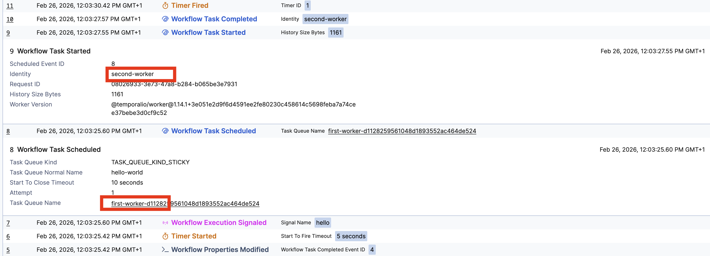

# Workflow Sticky Worker Recovery Scenario

This project reproduces the following scenario:
- A workflow starts using SDK version 1.17.1.
- The workflow sleeps for a period of time.
- A signal is sent to the workflow.
- Upon receiving the signal, a workflow task is scheduled on the original sticky worker.
- The original worker is no longer running.
- A new worker is started with a different SDK version (1.14.1).
- The workflow resumes execution, and the pending workflow task is dispatched to the new worker.





## Running the Project
1.	Start the Temporal server
2.	Run the script

```bash
./run.sh
```   


