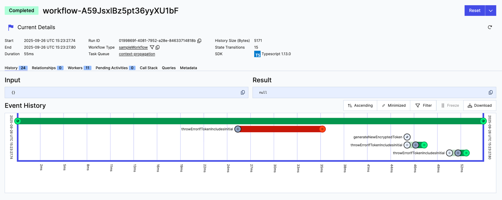

# Retry activity wityh new token if AuthError occurs

### Running this sample

1. `temporal server start-dev` to start [Temporal Server](https://github.com/temporalio/cli/#installation).
1. `npm install` to install dependencies.
1. `npm run start.watch` to start the Worker.
1. In another shell, `npm run workflow` to run the Workflow.

The code use context propagation to pass a token to activities. 
If the activity throws an `AuthError`, the workflow interceptor will catch it, generate a new token, store it, and retry the activity.
If after 5 retries with a new token the activity interceptor will stop retrying and throw the error back to the workflow.

Relevant code:
- [WorkflowOutBoundCallsInterceptor.scheduleLocalActivity](./src/context/workflow-interceptors.ts#L50)
- [WorkflowOutBoundCallsInterceptor.scheduleActivity](./src/context/workflow-interceptors.ts#L68)
- [WorkflowOutBoundCallsInterceptor.handleAuthError](./src/context/workflow-interceptors.ts#L150)

- 
